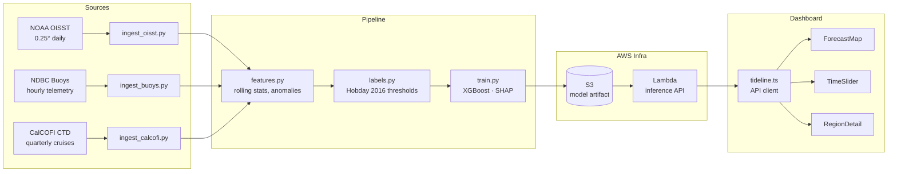

# Tideline

**Marine heatwave forecasting for the people who depend on the ocean.**

Tideline currently ships a two-model classification pipeline for marine heatwave detection and forecasting. The core dataset is built from NOAA OISST satellite rasters, NDBC buoy telemetry, and CalCOFI bottle profiles. Features are engineered into a spatial grid over the Southern California Bight, then used to train four lead-time LightGBM classifiers. A raster CNN exists in the codebase for a later GPU pass, but the current CPU baseline is the LightGBM path.

Current saved evaluation artifacts live in `backtest/metrics.json` and `models/lightgbm/artifacts/`.

---

## Who it's for

| Segment | Pain today | Tideline's answer |
|---|---|---|
| **Aquaculture** (salmon, oyster, shellfish farms) | Heat stress events cause mass die-offs with < 48 h warning | 14-day probabilistic forecast + SMS/email alert when P(MHW) > 70 % |
| **Fisheries management** | Stock assessments don't account for rapid habitat shifts | Forecast overlaid on species distribution models; API for quota tools |
| **Marine conservation** | Coral bleaching events missed until satellite imagery processed | Near-real-time SST anomaly alerts tied to specific MPAs |

---

## Architecture



---

## Current ML pipeline

### Datasets

- **NOAA OISST v2.1**: daily SST NetCDF files under `data/raw/oisst/`
- **NDBC buoys**: station parquet files under `data/raw/buoys/`
- **CalCOFI**: bottle profile parquet at `data/raw/calcofi/calcofi_bottles.parquet`

### Feature set

The feature table in `data/silver/feature_table.parquet` contains:

- `buoy_sst_idw`, `buoy_sst_7d_mean`, `buoy_sst_30d_mean`, `buoy_anomaly`
- `calcofi_temp_50m`, `calcofi_temp_100m`, `calcofi_salinity_50m`, `calcofi_chla`, `calcofi_thermocline_depth`
- `sat_sst`, `sat_sst_anomaly`, `sat_dhw`, `sat_sst_gradient`, `sat_days_since_cold`
- `mhw_status` plus lagged targets at 1, 3, and 7 days

These features help prediction in different ways:

- `buoy_sst_idw`: inverse-distance-weighted SST from the nearest buoys. This gives the model a localized surface temperature estimate even when a grid cell itself has no buoy.
- `buoy_sst_7d_mean`: 7-day rolling average of buoy SST. This smooths weather-scale noise and helps the model learn whether warming is sustained.
- `buoy_sst_30d_mean`: 30-day rolling average of buoy SST. This acts like a slow baseline and helps separate short spikes from longer warm periods.
- `buoy_anomaly`: deviation of the buoy SST from its local climatology. This is one of the clearest indicators that conditions are warmer than expected for that time of year.

- `calcofi_temp_50m`: temperature near 50 m depth. This helps detect whether warming is only at the surface or is penetrating the water column.
- `calcofi_temp_100m`: temperature near 100 m depth. Deeper warm water is a sign of stronger and more persistent heat stress.
- `calcofi_salinity_50m`: salinity near 50 m depth. Salinity changes often reflect water mass movement, upwelling, or mixing, which can affect heatwave formation.
- `calcofi_chla`: chlorophyll-related proxy from the CalCOFI profile. This helps capture biological response and mixed-layer context that can coincide with productive or stressed ocean conditions.
- `calcofi_thermocline_depth`: estimated thermocline depth. A deeper or shallower thermocline can signal how much mixing or stratification is present, which strongly affects whether heat can persist.

- `sat_sst`: satellite sea surface temperature at the grid cell. This is the main direct surface signal the model uses for forecasting heatwave likelihood.
- `sat_sst_anomaly`: deviation from the expected seasonal SST baseline. This is the most important feature for identifying whether the ocean is already warmer than normal.
- `sat_dhw`: degree heating weeks. This measures heat accumulation over time, so it helps the model distinguish a brief warm day from a developing marine heatwave.
- `sat_sst_gradient`: local SST gradient across neighboring cells. Sharp gradients often show fronts or boundaries between cooler and warmer water, which can affect event spread.
- `sat_days_since_cold`: days since the cell last experienced a cold-water condition. This helps the model understand how long the area has been in a warm regime.

- `mhw_status`: the binary target label used for training and evaluation. It marks whether a cell is currently in a marine heatwave state.
- `mhw_status` lagged by 1, 3, and 7 days: these are shifted target columns used to train the 1d / 3d / 5d / 7d lead-time classifiers.

### Models

- **CPU baseline**: four LightGBM binary classifiers for 1d / 3d / 5d / 7d lead times
- **GPU path**: raster CNN for future training on Brev or another GPU host

### Current score

The current backtest is saved in `backtest/metrics.json`. It reports classification metrics rather than R^2:

- ROC AUC
- PR AUC
- Brier score
- Confusion matrix at threshold 0.5

How to read the score:

- **ROC AUC** measures ranking quality: values near 1.0 mean the model separates positive and negative cases well, 0.5 is random, and `NaN` means there were not enough positive and negative examples in that split to compute it.
- **PR AUC** is more informative when events are rare, because it focuses on precision and recall for the positive class.
- **Brier score** measures probability calibration: lower is better, and values near 0 mean predicted probabilities are close to the observed outcomes.
- **Confusion matrix** at threshold 0.5 shows how often the model predicts event vs no-event.

The latest CPU-only quick run completed, but the current labels are degenerate enough that AUC / PR AUC are `NaN` and the event detection count is 0. That means there is no meaningful R^2 to report for the present pipeline, because the task is formulated as classification rather than regression. For a real accuracy readout, you should use ROC AUC, PR AUC, and Brier score once the feature/label path produces positive events in the evaluation window.

### Where to look

- LightGBM model files: `models/lightgbm/lightgbm_full_lead_*d.joblib`
- LightGBM metrics and plots: `models/lightgbm/artifacts/`
- Ensemble predictions: `models/ensemble/predictions_2023.parquet`
- Backtest summary: `backtest/metrics.json`
- Backtest figures: `backtest/figures/`

---

---

## Tech stack

| Layer | Technology |
|---|---|
| Language | Python 3.11, TypeScript (Node 20) |
| Data | xarray, netCDF4, pandas, numpy |
| ML | XGBoost, scikit-learn, SHAP |
| Serving | FastAPI + Uvicorn, AWS Lambda (container) |
| Cloud | S3 (data lake), Lambda, API Gateway |
| Dashboard | React 18, Vite, Deck.gl / MapLibre |
| Notebook | Marimo |
| Docs | Sphinx |

---

## Data pipeline

```
NOAA OISST (NetCDF) ──┐
NDBC buoys (CSV/API)  ├──► Bronze (raw parquet) ──► Silver (features) ──► Model
CalCOFI CTD (CSV)    ──┘
```

Heatwave label: SST > 90th-percentile climatology for ≥ 5 consecutive days (Hobday et al. 2016).

---

## Running locally

### Prerequisites

- Python 3.11+, `uv` or `pip`
- Node 20+, `pnpm` or `npm`
- AWS credentials configured (for S3/Lambda)

### 1. Python environment

```bash
python -m venv .venv && source .venv/bin/activate
pip install -e ".[dev]"
```

### 2. Ingest data

```bash
python pipeline/ingest_oisst.py    # downloads last 30 days of OISST
python pipeline/ingest_buoys.py    # pulls active West Coast buoys
python pipeline/ingest_calcofi.py  # syncs latest CalCOFI bottle data
```

### 3. Build features & train

```bash
python pipeline/features.py
python pipeline/labels.py
python pipeline/train.py           # saves model to models/xgb_tideline.json
```

### 4. Run inference API locally

```bash
uvicorn infra.aws.lambda_handler:app --reload --port 8000
```

### 5. Dashboard

```bash
cd dashboard
npm install
npm run dev                        # http://localhost:5173
```

### 6. Interactive notebook

```bash
marimo edit notebooks/tideline_analysis.py
```

---

## Repository layout

```
tideline/
├── pipeline/       # Ingestion, feature engineering, training
├── infra/aws/      # Lambda handler + dependencies
├── dashboard/      # React/Vite frontend
├── notebooks/      # Marimo exploratory analysis
├── docs/           # Sphinx documentation
├── demo/           # Pitch deck and demo script
└── data/           # Local cache — gitignored
```

---

## Team

Built at DS3 Hacks 2026.

---

## License

MIT
