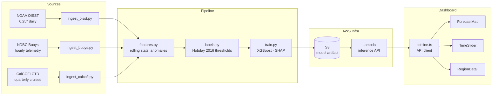

# Tideline

**Marine heatwave forecasting for the people who depend on the ocean.**

Tideline delivers 14-day probabilistic marine heatwave forecasts at 0.25° resolution, built on NOAA OISST satellite data, NDBC buoy telemetry, and CalCOFI oceanographic surveys. A single XGBoost model trained on Hobday et al. (2016) climatological thresholds powers the forecast; a React dashboard and AWS Lambda inference API put it in operators' hands within seconds.

---

## Who it's for

| Segment | Pain today | Tideline's answer |
|---|---|---|
| **Aquaculture** (salmon, oyster, shellfish farms) | Heat stress events cause mass die-offs with < 48 h warning | 14-day probabilistic forecast + SMS/email alert when P(MHW) > 70 % |
| **Fisheries management** | Stock assessments don't account for rapid habitat shifts | Forecast overlaid on species distribution models; API for quota tools |
| **Marine conservation** | Coral bleaching events missed until satellite imagery processed | Near-real-time SST anomaly alerts tied to specific MPAs |

---

## Architecture



---

## Tech stack

| Layer | Technology |
|---|---|
| Language | Python 3.11, TypeScript (Node 20) |
| Data | xarray, netCDF4, pandas, numpy |
| ML | XGBoost, scikit-learn, SHAP |
| Serving | FastAPI + Uvicorn, AWS Lambda (container) |
| Cloud | S3 (data lake), Lambda, API Gateway |
| Dashboard | React 18, Vite, Deck.gl / MapLibre |
| Notebook | Marimo |
| Docs | Sphinx |

---

## Data pipeline

```
NOAA OISST (NetCDF) ──┐
NDBC buoys (CSV/API)  ├──► Bronze (raw parquet) ──► Silver (features) ──► Model
CalCOFI CTD (CSV)    ──┘
```

Heatwave label: SST > 90th-percentile climatology for ≥ 5 consecutive days (Hobday et al. 2016).

---

## Running locally

### Prerequisites

- Python 3.11+, `uv` or `pip`
- Node 20+, `pnpm` or `npm`
- AWS credentials configured (for S3/Lambda)

### 1. Python environment

```bash
python -m venv .venv && source .venv/bin/activate
pip install -e ".[dev]"
```

### 2. Ingest data

```bash
python pipeline/ingest_oisst.py    # downloads last 30 days of OISST
python pipeline/ingest_buoys.py    # pulls active West Coast buoys
python pipeline/ingest_calcofi.py  # syncs latest CalCOFI bottle data
```

### 3. Build features & train

```bash
python pipeline/features.py
python pipeline/labels.py
python pipeline/train.py           # saves model to models/xgb_tideline.json
```

### 4. Run inference API locally

```bash
uvicorn infra.aws.lambda_handler:app --reload --port 8000
```

### 5. Dashboard

```bash
cd dashboard
npm install
npm run dev                        # http://localhost:5173
```

### 6. Interactive notebook

```bash
marimo edit notebooks/tideline_analysis.py
```

---

## Repository layout

```
tideline/
├── pipeline/       # Ingestion, feature engineering, training
├── infra/aws/      # Lambda handler + dependencies
├── dashboard/      # React/Vite frontend
├── notebooks/      # Marimo exploratory analysis
├── docs/           # Sphinx documentation
├── demo/           # Pitch deck and demo script
└── data/           # Local cache — gitignored
```

---

## Team

Built at DS3 Hacks 2026.

---

## License

MIT
