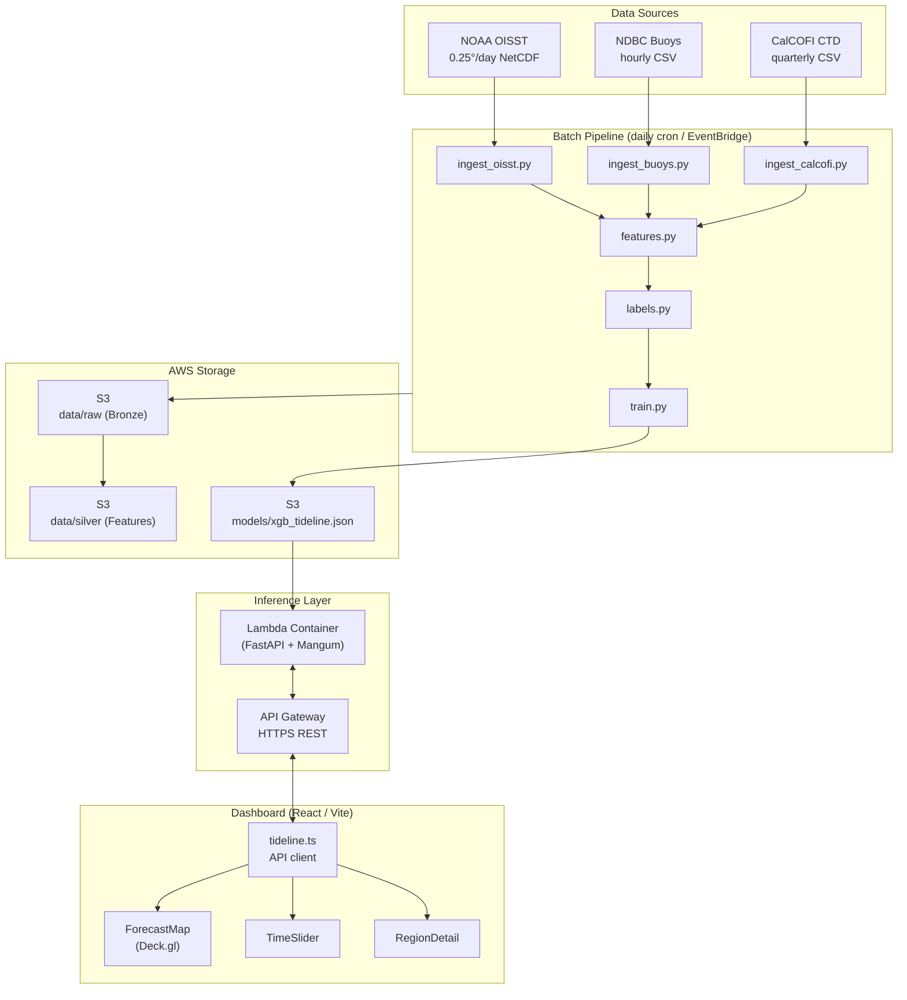

# Tideline — System Architecture

## High-level overview

## Data flow

| Stage | Format | Location | Updated |
|---|---|---|---|
| Raw OISST | NetCDF (.nc) | S3 `raw/oisst/` | Daily |
| Raw buoys | Parquet | S3 `raw/buoys/` | Hourly |
| Raw CalCOFI | Parquet | S3 `raw/calcofi/` | Quarterly |
| Silver features | Parquet | S3 `silver/features.parquet` | Daily |
| Labeled features | Parquet | S3 `silver/features_labeled.parquet` | Daily |
| Model artifact | JSON (XGBoost native) | S3 `models/` | Weekly retrain |

## Inference latency budget

| Step | Target |
|---|---|
| API Gateway → Lambda cold start | < 3 s |
| Feature lookup | < 50 ms |
| XGBoost predict (14-day grid) | < 100 ms |
| Total P95 | < 500 ms |

## Security

- Lambda IAM role: read-only S3 access to `models/` prefix
- API Gateway: API key auth for production; open for hackathon demo
- No SST data persisted on Lambda (stateless)
